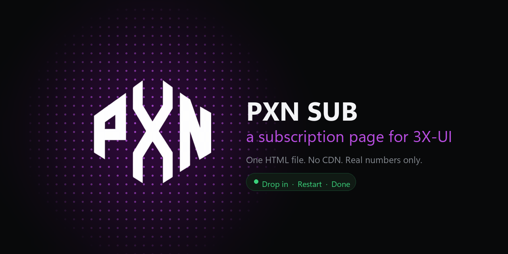

<div align="center">



<br><br>

**A single-file subscription page for [3X-UI][3xui].**
Usage ring, real latency, and optional live CPU / RAM / network from the box itself.

<sub>One `index.html` · no CDN · airgap-safe · no binary patching</sub>

</div>

---

## Install

Copy the page in, point the panel at it, restart:

```bash
bash <(curl -Ls https://raw.githubusercontent.com/NightRiderr77/PXN-SUB/main/scripts/install.sh)
```

Then set **Settings → Subscription → Sub Theme Directory** to the folder it
names, and run `x-ui restart`.

That is the whole thing. The installer also sets up a small collector so the
server-monitor panel shows real numbers.

<details>
<summary><b>Other install modes</b></summary>

<br>

**Brandless** — for servers you hand to resellers. Nothing identifies the
operator anywhere in the markup:

```bash
bash <(curl -Ls https://raw.githubusercontent.com/NightRiderr77/PXN-SUB/main/scripts/install.sh) --brandless
```

**Brandless, page only** — no collector, no daemon:

```bash
bash <(curl -Ls https://raw.githubusercontent.com/NightRiderr77/PXN-SUB/main/scripts/install.sh) --brandless --no-stats
```

**By hand** — copy `index.html` to e.g. `/usr/local/x-ui/pxn_sub/`, point the
panel's *Sub Theme Directory* at it, `x-ui restart`. Latency is still real; the
server monitor reads `—` until the collector is installed.

**Uninstall:**

```bash
sudo ./scripts/uninstall.sh              # collector + theme
sudo ./scripts/uninstall.sh --keep-theme # collector only
```

Then clear the *Sub Theme Directory* field and `x-ui restart`.

</details>

## What it shows

|  |  |
|---|---|
| 📊 **The plan** | Name, active or disabled, last online, expiry with a days-left chip, and a usage ring driven by real panel data. |
| 📈 **Data used** | Upload, download, used and remaining, with a progress bar. |
| 🖥️ **Server monitor** | CPU, memory and network with live sparklines — **only when the collector is running.** Otherwise `—` and an `offline` chip. |
| 🌍 **Infrastructure** | Provider, region, and a real client→server latency check, colour-coded. |
| 📋 **Actions** | Copy the subscription link, plus setup guides and support on the branded build. |

Built only on 3X-UI's **documented** template variables, so it runs on a stock
panel. The live stats are layered on top — if the data is not there, the page
still works.

**No invented numbers.** Where a figure cannot be measured it is shown as `—`,
never as a plausible-looking value.

## Brandless means deleted, not hidden

The installer removes the logo, the support links, the footer and the tab title
from its copy of the markup. It does not hide them with CSS — the markup would
still carry the domain and phone number, and anyone can open view-source. The
installer aborts rather than install a page that still matches `pxnstores`,
`PXN STORES` or `wa.me`.

## Requirements

3X-UI with subscriptions enabled, and root on the VPS for the collector. The
page itself needs nothing but the panel.

<details>
<summary><b>How the live stats reach the page</b></summary>

<br>

A small Python service samples the box and writes a `status.json` beside the
theme; the page fetches it on a timer. No reverse proxy, no panel patching,
nothing listening on a new port. See [`scripts/pxn_stats.py`](scripts/pxn_stats.py)
and [`docs/design.md`](docs/design.md).

</details>

## Licence

MIT — see [LICENSE](LICENSE). Live-stats approach informed by a read-only study
of [3X-SUB][3xsub]'s collector pattern; no code copied.

---

<div align="center">
<sub>Built by <b><a href="https://www.pxnstores.lk">PXN Stores LK</a></b> in Sri Lanka</sub>
</div>

[3xui]: https://github.com/MHSanaei/3x-ui
[3xsub]: https://github.com/xLordGrim/3X-SUB
